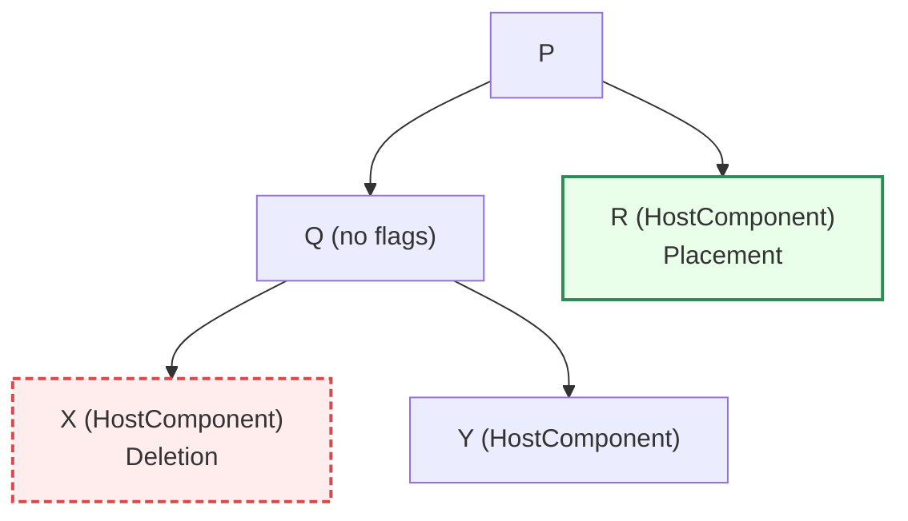

# Commit Phase

上一篇讲解了 React 运行时两个关键阶段中的 **Render Phase**，所以这篇我们将来介绍 **Commit Phase**。

## 概览
```js {1-2,4} title="fib.ex" showLineNumbers /palindrome/#v
let a1;
let a2;
let a3;
```

在 **Render Phase**，针对不同种类的更新，会给 fiber 打上不同的 `flags`，例如：插入、替换、删除元素等。
而 **Commit Phase** 的主要任务就是处理这些 `flags`，并通过操作DOM提交到宿主环境的UI中。

> 注意：
> Render Phase 流程可以中断；而 Commit Phase 一旦开始，就会同步执行直到完成。
> 这是因为 commit 阶段会对DOM进行操作，如果中断DOM 可能处于“半新半旧”的状态：有的节点已插入，有的还没删除、事件有的已换新有的仍旧。这会导致浏览器可能在中断期间绘制出不一致的界面（撕裂）。
> 而Render 阶段 并不会操作DOM，所有可以中断。

执行 Commit Phase 的函数是 `CommitRoot`。


```js {1,3-4} showLineNumbers
// facebook/react/packages/react-reconciler/src/ReactFiberWorkLoop.js
function commitRoot(root: FiberRoot, finishedWork: null | Fiber, lanes: Lanes){
  if (subtreeHasBeforeMutationEffects || rootHasBeforeMutationEffect) {
    const prevExecutionContext = executionContext;
    executionContext |= CommitContext;
    // The first phase a "before mutation" phase. We use this phase to read the
    // state of the host tree right before we mutate it. This is where
    // getSnapshotBeforeUpdate is called.
    commitBeforeMutationEffects(root, finishedWork, lanes);
  }

  if (enableViewTransition && willStartViewTransition) {
     // 省略
  } else {
    // Flush synchronously.
    flushMutationEffects();
    flushLayoutEffects();
    // Skip flushAfterMutationEffects
    flushSpawnedWork();
  }
}
```

整个执行栈为下图:


Commit phase 可以分为**三个阶段**，对应上图中的方法 1、2、3：

*   **BeforeMutation**
*   **Mutation**
*   **Layout**

> 上图为我根据React19源码绘制的调用栈， 与React18略有不同

## 更新标志

既然 Render Phase 中给 fiber 打的标志的处理会在 Commit Phase 执行， 那么我们有必要了解一下都有哪些标志：

*   **更新**：Update、Ref
*   **元素**：Placement、Update、ChildDeletion、Snapshot、Visibility、ContentReset
*   **更新回调，执行effect**： Callback-root、类组件回调、Passive、Layout、Insertion

## 1. 第一阶段： beforeMutation

`beforeMutation` 阶段做的事可以用一句话来概括：
在真正改动 DOM 之前，深度优先地扫描 Fiber 树，把所有和「删除、getSnapshotBeforeUpdate、视图过渡 (View Transition)」有关的副作用都提前处理好。

**所以,这个阶段的目的是在旧的 DOM 被真正的修改之前，完成那些依赖于旧的 DOM 的任务。**

### 1.1 - beforeMutation入口: `commitBeforeMutationEffects`

```js
//facebook/react/packages/react-reconciler/src/ReactFiberCommitWork.js

export function commitBeforeMutationEffects(
  root: FiberRoot,
  firstChild: Fiber,
  committedLanes: Lanes,
): void {
  focusedInstanceHandle = prepareForCommit(root.containerInfo); //记录当前获得焦点的宿主节点（为了后面做 `blur / focus` 修复）
  shouldFireAfterActiveInstanceBlur = false;
  //React 19 加入 View Transition API 集成；只有满足所有更新都在 transition 车道时才会走相关逻辑
  const isViewTransitionEligible =
    enableViewTransition &&
    includesOnlyViewTransitionEligibleLanes(committedLanes);

  // 把深度优先遍历的游标指向整颗 finishedWork 树的根
  nextEffect = firstChild;
  commitBeforeMutationEffects_begin(isViewTransitionEligible); // 真正的 DFS 循环（下面详解）。

  // We no longer need to track the active instance fiber
  focusedInstanceHandle = null;
  // We've found any matched pairs and can now reset.
  resetAppearingViewTransitions();
}
```

`commitBeforeMutationEffects` 为 **beforeMutation** 阶段的入口函数，调用了`commitBeforeMutationEffects_begin` 函数。

`nextEffect` 用来追踪 commit Phase 中下一个需要处理的fiber，类似于 Render Phase 中的 `workInProgress`。

### 1.2 - beforeMutation向下递: `commitBeforeMutationEffects_begin`

```js
//facebook/react/packages/react-reconciler/src/ReactFiberCommitWork.js

function commitBeforeMutationEffects_begin(isViewTransitionEligible: boolean) {
  // If this commit is eligible for a View Transition we look into all mutated subtrees.
  // TODO: We could optimize this by marking these with the Snapshot subtree flag in the render phase.
  const subtreeMask = isViewTransitionEligible
    ? BeforeAndAfterMutationTransitionMask
    : BeforeMutationMask;
  while (nextEffect !== null) {
    const fiber = nextEffect;
    const child = fiber.child;
    // 按需剪枝
    if ((fiber.subtreeFlags & subtreeMask) !== NoFlags && child !== null) {
      child.return = fiber;
      nextEffect = child;
    } else {
      commitBeforeMutationEffects_complete(isViewTransitionEligible);
    }
  }
}
```

熟悉 React 的同学应该知道， React 的**生命周期**和**effect钩子**的执行顺序是**先子后父**。
这样做的原因归结于 **DOM 操作的顺序**。

*   React 需要先完成子组件的 DOM 插入/更新，再处理父组件的 DOM。
*   **父组件的 DOM 依赖于子组件的 DOM**。例如，父组件挂载时需要确保子组件的 DOM 已经插入到父组件的 DOM 节点中。
*   如果父组件的 `componentDidMount` 先执行，此时子组件的 DOM 可能尚未就绪，导致父组件无法正确操作子组件的 DOM。

`commitBeforeMutationEffects_begin` 为了实现这一原则，做了两件事情：

1.  如果子代 fiber 树有 `buforeMutation` 的标志，那么将 `nextEffect` 指向 child fiber。等同于向下递归，直至找到最底部且有该标志的fiber。
2.  执行 `commitBeforeMutationEffects_complete`，并向上归并。

### 1.3 - beforeMutationd向上归: `commitBeforeMutationEffects_complete`

```js
// facebook/react/packages/react-reconciler/src/ReactFiberCommitWork.js
function commitBeforeMutationEffects_complete(
  isViewTransitionEligible: boolean,
) {
  while (nextEffect !== null) {
    const fiber = nextEffect;
    commitBeforeMutationEffectsOnFiber(fiber, isViewTransitionEligible);

    const sibling = fiber.sibling;
    if (sibling !== null) {
      sibling.return = fiber.return;
      nextEffect = sibling;
      return;
    }

    nextEffect = fiber.return;
  }
}
```

从上面代码可以看出，`commitBeforeMutationEffects_complete` 函数非常简单， 就是一个向上循环归并的流程。
过程中，会先执行`commitBeforeMutationEffectsOnFiber`，该方法也是 `BeforeMutation` 阶段真正要做的事情。
如果有兄弟节点，则会先将 `nextEffect` 指向兄弟节点并处理兄弟节点上的 BeforeMutation 相关 flag， 如果没有则指向父节点。

接下来看一下核心方法 `commitBeforeMutationEffectsOnFiber` 的流程是什么：

### 1.4 - 每个节点如何执行： `commitBeforeMutationEffectsOnFiber`

```js
// facebook/react/packages/react-reconciler/src/ReactFiberCommitWork.js
function commitBeforeMutationEffectsOnFiber(
  finishedWork: Fiber,
  isViewTransitionEligible: boolean,
) {
  const current = finishedWork.alternate;
  const flags = finishedWork.flags;

  // 根据不同类型的 Fiber 执行不同的操作
  switch (finishedWork.tag) {
    case FunctionComponent: {
      if (enableUseEffectEventHook) {
        if ((flags & Update) !== NoFlags) {
          const updateQueue: FunctionComponentUpdateQueue | null =
            (finishedWork.updateQueue: any);
          const eventPayloads =
            updateQueue !== null ? updateQueue.events : null;
          if (eventPayloads !== null) {
            for (let ii = 0; ii < eventPayloads.length; ii++) {
              const {ref, nextImpl} = eventPayloads[ii];
              ref.impl = nextImpl;
            }
          }
        }
      }
      break;
    }
    case ClassComponent: {
      if ((flags & Snapshot) !== NoFlags) {
        if (current !== null) {
          commitClassSnapshot(finishedWork, current);
        }
      }
      break;
    }
    case HostRoot: {
      if ((flags & Snapshot) !== NoFlags) {
        if (supportsMutation) {
          const root = finishedWork.stateNode;
          clearContainer(root.containerInfo);
        }
      }
      break;
    }
    case HostComponent:
    case HostHoistable:
    case HostSingleton:
    case HostText:
    case HostPortal:
    case IncompleteClassComponent:
      // Nothing to do for these component types
      break;
    case ViewTransitionComponent:
      if (enableViewTransition) {
        if (isViewTransitionEligible) {
          if (current === null) {
            // This is a new mount. We should have handled this as part of the
            // Placement effect or it is deeper inside a entering transition.
          } else {
            // Something may have mutated within this subtree. This might need to cause
            // a cross-fade of this parent. We first assign old names to the
            // previous tree in the before mutation phase in case we need to.
            // TODO: This walks the tree that we might continue walking anyway.
            // We should just stash the parent ViewTransitionComponent and continue
            // walking the tree until we find HostComponent but to do that we need
            // to use a stack which requires refactoring this phase.
            commitBeforeUpdateViewTransition(current, finishedWork);
          }
        }
        break;
      }
    // Fallthrough
    default: {
      if ((flags & Snapshot) !== NoFlags) {
        throw new Error(
          'This unit of work tag should not have side-effects. This error is ' +
            'likely caused by a bug in React. Please file an issue.',
        );
      }
    }
  }
}
```

`commitBeforeMutationEffectsOnFiber` 的目的是在 **DOM 还没被真正改写之前** 完成所有需要旧 DOM 状态的工作（典型例子就是 `getSnapshotBeforeUpdate`）。
具体会根据不同 tag 的 fiber，执行不同的处理。

*   **FunctionComponent**：当启用了 **`useEffectEvent`** 实验特性，并且此 fiber 有 **`Update`** 标记时， React 把事件 ref 上保存的实现函数替换为这次 render 派生出的最新闭包，  这样事件系统在后续阶段就能拿到“最新版本”的回调，而不必等到 Layout。

*   **ClassComponent**： 如果旧树 (`current`) 存在并且打了 **`Snapshot`** 标记，  调用`commitClassSnapshot`，这会触发 **`getSnapshotBeforeUpdate`**，  将其返回值暂存到实例上，供稍后执行 `componentDidUpdate` 时使用。

*   **HostRoot**：`HostRoot` 即根容器。如果它携带 `Snapshot` 标记且当前渲染器支持 DOM Mutation，  `clearContainer` 会把根节点 DOM 子树清空（通常发生在离线树 / hydration 失败回退）。

*   **其他Host类型**：直接跳过

**总结**： `beforeMutation`的作用是在 **DOM 还没被真正改写之前** 完成所有需要旧 DOM 状态的工作， 主要处理取快照、事件刷新等

***


## 2. 第二阶段：mutation

Mutation 阶段 = 深度优先 + 先删后子树再本节点；在这个阶段，React 用 `flags/subtreeFlags` 精准定位变更，删节点/解绑旧 ref/安插或移动 DOM/打补丁文本与属性，且执行 `useInsertionEffect`; 为随后的 **layout 阶段**（生命周期与 layout effects、新 ref 绑定）铺平道路。

### 2.1 - Mutation入口: `commitMutationEffects`

在 `commitMutationEffects` 方法中，调用了 `commitMutationEffectsOnFiber` 函数， 来处理每一个有 mutationEffect flag 的 fiber。

```ts
// facebook/react/packages/react-reconciler/src/ReactFiberCommitWork.js
export function commitMutationEffects(
  root: FiberRoot,
  finishedWork: Fiber,
  committedLanes: Lanes,
) {
  inProgressLanes = committedLanes;
  inProgressRoot = root;

  rootViewTransitionAffected = false;
  inUpdateViewTransition = false;

  resetComponentEffectTimers();

  commitMutationEffectsOnFiber(finishedWork, root, committedLanes);

  inProgressLanes = null;
  inProgressRoot = null;
}
```

> 值得注意的是：Mutation 的DFS实现并没有像BeforeMutation用 `nextEffect` 游标 + `begin/complete` 这种**非递归 DFS**。 而是采用了直接**递归**，顺便就把“先删→子→父”的时序写清楚了；因此没有必要再显式拆 `begin/complete`。


为了更直观地展示这一过程，下面用一个简单的例子来说明一下：

总体流程：

1.  先沿着根节点的child指针一直遍历，直到某个fiber 的 child 指针为空。
2.  如果有 sibling，回到处理 sibling， 重复 step1
3.  如果没有 sibling 返回父节点，检查父节点sibling


### 2.2 - 每个节点如何执行: `commitMutationEffectsOnFiber`

`commitMutationEffectsOnFiber`在递归之后立刻完成本节点所有 mutation 工作（包括 Reconciliation、副作用以及 Ref 的 attach/detach

```js
// facebook/react/packages/react-reconciler/src/ReactFiberCommitWork.js
function commitMutationEffectsOnFiber(
  finishedWork: Fiber,
  root: FiberRoot,
  lanes: Lanes,
){
 switch (finishedWork.tag) {
    case FunctionComponent:
    case ForwardRef:
    case MemoComponent:
    case SimpleMemoComponent: {
      /** DFS */
      recursivelyTraverseMutationEffects(root, finishedWork, lanes);
      /** handle REPLACEMENT effect */
      commitReconciliationEffects(finishedWork, lanes);

      if (flags & Update) {
        /** unmount useInsertionEffect */
        commitHookEffectListUnmount(
          HookInsertion | HookHasEffect,
          finishedWork,
          finishedWork.return,
        );

        // TODO: Use a commitHookInsertionUnmountEffects wrapper to record timings.
        /** mount userInsertionEffect */
        commitHookEffectListMount(HookInsertion | HookHasEffect, finishedWork);
        /** unmount useLayoutEffect, and mount in layoutEffect phase */
        commitHookLayoutUnmountEffects(
          finishedWork,
          finishedWork.return,
          HookLayout | HookHasEffect,
        );
      }
      break;
    }
    case ClassComponent: {
      recursivelyTraverseMutationEffects(root, finishedWork, lanes);
      commitReconciliationEffects(finishedWork, lanes);

      if (flags & Ref) {
        if (!offscreenSubtreeWasHidden && current !== null) {
          /** Detatch Ref */
          safelyDetachRef(current, current.return);
        }
      }

      if (flags & Callback && offscreenSubtreeIsHidden) {
        const updateQueue: UpdateQueue<mixed> | null =
          (finishedWork.updateQueue: any);
        if (updateQueue !== null) {
          deferHiddenCallbacks(updateQueue);
        }
      }
      break;
    }
 }
}
```

1.  该方法首先会调用 `recursivelyTraverseMutationEffects`, 对每个含变更的子树都进行 DFS；在进入父 fiber 之前先处理其 deletions，然后递归处理子，回到当前 fiber 时再处理它自己的效果。关于`recursivelyTraverseMutationEffects`函数的具体操作，在下面会详细讲解。
2.  然后调用 `commitReconciliationEffects` 方法来处理 flag 包含 PLACEMENT 的节点。PLACEMENT 可以包括节点的移动以及插入。
3.  卸载旧的useInsertionEffect，并执行新的useInsertionEffect。
4.  卸载旧的useLayoutEffect，为在Commit 的 Layout阶段执行新的 useLayoutEffect 做准备。

**例子1：**



以上面的fiber tree 为例：

*   到 `P`：`P.deletions` 无 → 递归子树
*   到 `Q`：
    *   **先处理 `Q.deletions`**：删除 `X`（cleanup → detach ref → removeChild）
    *   递归子树：进入 `Y`（无事）→ 返回 `Q`
    *   处理 `Q` 自己（无 Placement/Update）
*   回到 `P` 走 `R`：
    *   `R` 无子树 → 回到 `R` 自己：**Placement** → 插入 `R` 的 DOM
*   回到 `P` 自己（若有再处理）

### 2.3 - 深度优先遍历策略: `recursivelyTraverseMutationEffects`

`recursivelyTraverseMutationEffects` 会先统一处理所有删除，再递归进入子树。这样做是是为了保证 **顺序、可见性一致性、锚点稳定性、以及正确的卸载清理**。

在Render Phase 的reconcileChildren方法中，删除信息记录在**父 Fiber** 的字段 **`deletions: Fiber[] | null`** 里，同时父 Fiber 的 **`flags`** 会打上 **`ChildDeletion`** 用来提示提交阶段去处理这批删除。

所以，`recursivelyTraverseMutationEffects` 中可以通过遍历 fiber 的 `deletions`，调用 `commitDeletionEffects` 删除它的子节点。

```js
// facebook/react/packages/react-reconciler/src/ReactFiberCommitWork.js
function recursivelyTraverseMutationEffects(
  root: FiberRoot,
  parentFiber: Fiber,
  lanes: Lanes,
) {
  // Deletions effects can be scheduled on any fiber type. They need to happen
  // before the children effects have fired.
  const deletions = parentFiber.deletions;
  if (deletions !== null) {
    for (let i = 0; i < deletions.length; i++) {
      const childToDelete = deletions[i];
      commitDeletionEffects(root, parentFiber, childToDelete);
    }
  }

  // check if subtree has a Mutation related flag,
  // if false, means already reach the final fiber with mutation flag
  // then return to commitMutationEffectsOnFiber to proccess the fiber
  if (
    parentFiber.subtreeFlags &
    (enablePersistedModeClonedFlag ? MutationMask | Cloned : MutationMask)
  ) {
    let child = parentFiber.child;
    while (child !== null) {
      commitMutationEffectsOnFiber(child, root, lanes);
      child = child.sibling;
    }
  }
}
```

***

## 3. 第三阶段：Layout

在执行完 Mutation 阶段，接下来就来到了 Layout 阶段。Layout 阶段的入口函数为 `commitLayoutEffects`。

### 3.1 - Layout入口函数：commitLayoutEffects

```js
// facebook/react/blob/main/packages/react-reconciler/src/ReactFiberCommitWork.js
export function commitLayoutEffects(
  finishedWork: Fiber,
  root: FiberRoot,
  committedLanes: Lanes,
): void {
  inProgressLanes = committedLanes;
  inProgressRoot = root;

  resetComponentEffectTimers();

  const current = finishedWork.alternate;
  commitLayoutEffectOnFiber(root, current, finishedWork, committedLanes);

  inProgressLanes = null;
  inProgressRoot = null;
}
```

Layout 阶段的流程和 Mutation 阶段差不多，都会调用 `commitXxxEffectOnFiber` 和 `recursivelyTraverseXxxEffects`。

### 3.2 - 每个节点如何执行: commitLayoutEffectOnFiber

```js
// facebook/react/blob/main/packages/react-reconciler/src/ReactFiberCommitWork.js

function commitLayoutEffectOnFiber(
  finishedRoot: FiberRoot,
  current: Fiber | null,
  finishedWork: Fiber,
  committedLanes: Lanes,
): void {
  const prevEffectStart = pushComponentEffectStart();
  const prevEffectDuration = pushComponentEffectDuration();
  const prevEffectErrors = pushComponentEffectErrors();
  // When updating this function, also update reappearLayoutEffects, which does
  // most of the same things when an offscreen tree goes from hidden -> visible.
  const flags = finishedWork.flags;
  switch (finishedWork.tag) {
    case FunctionComponent:
    case ForwardRef:
    case SimpleMemoComponent: {
      recursivelyTraverseLayoutEffects(
        finishedRoot,
        finishedWork,
        committedLanes,
      );
      if (flags & Update) {
        commitHookLayoutEffects(finishedWork, HookLayout | HookHasEffect);
      }
      break;
    }
    case ClassComponent: {
      recursivelyTraverseLayoutEffects(
        finishedRoot,
        finishedWork,
        committedLanes,
      );
      if (flags & Update) {
        commitClassLayoutLifecycles(finishedWork, current);
      }

      if (flags & Callback) {
        commitClassCallbacks(finishedWork);
      }

      if (flags & Ref) {
        safelyAttachRef(finishedWork, finishedWork.return);
      }
      break;
    }
    case HostRoot: {
      const prevProfilerEffectDuration = pushNestedEffectDurations();
      recursivelyTraverseLayoutEffects(
        finishedRoot,
        finishedWork,
        committedLanes,
      );
      if (flags & Callback) {
        commitRootCallbacks(finishedWork);
      }
      if (enableProfilerTimer && enableProfilerCommitHooks) {
        finishedRoot.effectDuration += popNestedEffectDurations(
          prevProfilerEffectDuration,
        );
      }
      break;
    }
   }
```

该方法会调用`recursivelyTraverseLayoutEffects`执行深度优先遍历，确保找到 fiber tree 中最后一个带有 LayoutMask flag 的fiber，并自底向上开始处理。
如果已抵达最后一个LayoutMask flag 的fiber， 则会根据不同 fiber 的类型（tag），来执行对应的操作：

*   **函数组件**：
    1.  **挂载useLayoutEffect**:
        ```js
        commitHookLayoutEffects(finishedWork, HookLayout | HookHasEffect);
        ```
        *   调用 `commitHookLayoutEffects`，重新挂载在 Mutation 阶段清理掉的 `useLayoutEffect`
*   **类组件**：
    1.  **布局生命周期**:
        ```js
        commitClassLayoutLifecycles(finishedWork, current)
        ```
        *   **首挂载**：`componentDidMount()`
        *   **更新**：`componentDidUpdate(prevProps, prevState, snapshot)`\
            其中 `snapshot` 来源于 **before-mutation** 阶段的 `getSnapshotBeforeUpdate`。
    2.  **setState 回调**:
        ```js
        commitClassCallbacks(finishedWork);
        ```
        *   调用通过 `setState(updater, callback)` 注册的 **callback**。
    3.  **挂载/更新 ref（attach）**:\*\* \*\*
        ```js
        safelyAttachRef(finishedWork, finishedWork.return);
        ```
        *   在 **mutation 阶段**旧 ref 已 **detach**；此处把 `ref` 指向 **类实例**

### 3.3 - recursivelyTraverseLayoutEffects

```js
// facebook/react/blob/main/packages/react-reconciler/src/ReactFiberCommitWork.js

function recursivelyTraverseLayoutEffects(
  root: FiberRoot,
  parentFiber: Fiber,
  lanes: Lanes,
) {
  if (parentFiber.subtreeFlags & LayoutMask) {
    let child = parentFiber.child;
    while (child !== null) {
      const current = child.alternate;
      commitLayoutEffectOnFiber(root, current, child, lanes);
      child = child.sibling;
    }
  }
}
```

`recursivelyTraverseLayoutEffects` 函数逻辑很简单。 和 Mutation 阶段的 `recursivelyTraverseMutationEffects` 操作相近。 通过 DFS 找到最后一个包含 Layout 相关操作 flag 的fiber，并从该 fiber 开始处理。

到这，Commit 的三个阶段的工作就完成。那么问题来了，`useInsertionEffect` 会在 Mutation 阶段执行， `useLayoutEffect` 会在 Layout 阶段执行， 那么 `useUffect` 什么时候执行呢。

其实，layout 子阶段之后，React 会异步安排一次被动副作用刷新（flush）；在这次刷新里，先执行 cleanup（旧的 useEffect） ，再执行create(新的 useEffect)这些都发生在 浏览器绘制(paint)之后，不阻塞页面更新。

## 总结

Commit Phase 的主要任务就是处理在 Render Phase 标记的这些 flags，并提交到宿主环境的UI中。

### BeforeMutation

*   begin: 向下递，找到最底部的包含 在 Before Mutation 阶段需要处理的标记
*   complete：
    *   向上归，调用 commitEffectBeforeMutationOnFiber 来获取 DOM 更新前的快照。
    *   如果有 sibling，将 nextEffect 指向 sibling。

### Mutation

*   recursivelyTraverseMutationEffects:
    *   向下递，找到最底部的包含 在 Mutation 阶段需要处理的标记
    *   调用 commitDeletion 执行删除元素操作。
*   commitMutationEffectsOnFiber：
    *   置空文本节点和ref
    *   插入元素节点
    *   执行 hook useInsertionEffect
    *   更新文本节点
    *   更新元素节点

### Layout

*   recursivelyTraverseLayoutEffects:
    *   向下递，找到最底部的包含 在 Layout 阶段需要处理的标记
*   commitLayoutEffectOnFiber：
    *   执行回调函数
    *   setState的callBack
    *   生命周期函数 componentDidMount/componentDidUpdate
    *   useLayoutEffect
