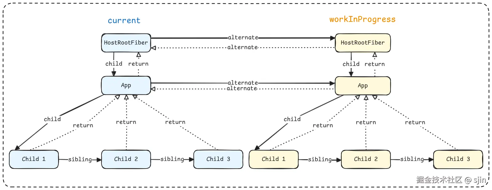
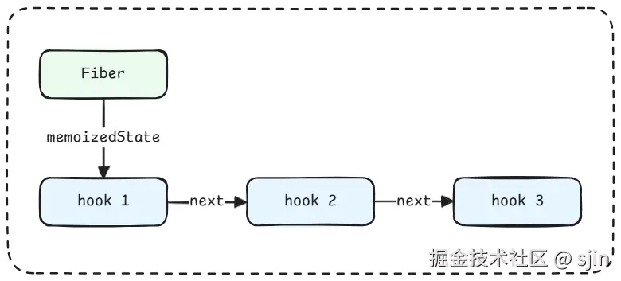
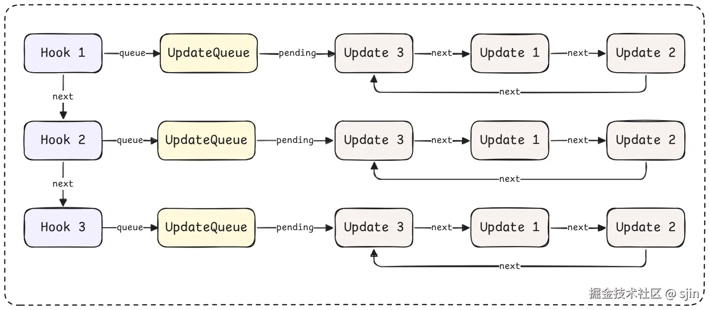

# React 中的数据结构

这篇文章将着重介绍 React 中的几个重要的数据结构以及设计思想。

## Fiber 树

这里仅对 Fiber 进行一个简单的介绍，如想了解 Fiber 架构的细节，包括**双缓冲树**，可以阅读该源码系列的另一篇文章：[React源码 - 大名鼎鼎的Fiber](https://juejin.cn/post/7549637439360466970)

Fiber 树可以说是 React 内部最重要的一种数据结构了，它帮助 React 实现了**可中断渲染**以及**优先级调度**。它拥有 `child`、`sibling` 和 `return` 三个指针，分别表示：

*   `child`: 第一个子节点
*   `sibling`: 串联兄弟节点
*   `return`: 父节点

下面是 Fiber 节点构造函数的源码：

```js title="packages/react-reconciler/src/ReactFiber.js"
function FiberNode(
  this: $FlowFixMe,
  tag: WorkTag,
  pendingProps: mixed,
  key: null | string,
  mode: TypeOfMode,
) {
  // Instance
  this.tag = tag; // fiber 类型
  this.key = key; // 用于调和子节点
  this.elementType = null;
  this.type = null; // 元素类型
  this.stateNode = null; // 对应的真实 DOM 元素

  // Fiber 链表结构
  this.return = null; // 指向父节点（父节点）
  this.child = null;  // 指向第一个子节点（子节点）
  this.sibling = null; // 指向下一个兄弟节点（兄弟节点）
  this.index = 0;     // 在父节点的子节点列表中的索引位置

  this.ref = null;
  this.refCleanup = null;

 // Props 和 State
  this.pendingProps = pendingProps; // 新一轮渲染中传入的新 props
  this.memoizedProps = null;        // 上一次渲染时使用的 props
  this.updateQueue = null;          // 状态更新队列，存储 setState 产生的更新对象
  this.memoizedState = null;        // 上一次渲染时使用的 state
  this.dependencies = null;         // 当前 Fiber 所依赖的上下文（Context）、事件订阅等

  this.mode = mode;

  // Effects
  this.flags = NoFlags;         // 当前 Fiber 需要执行的副作用（如 Placement, Update, Deletion）
  this.subtreeFlags = NoFlags;  // 子节点树中需要执行的副作用（用于性能优化）
  this.deletions = null;        // 待删除的子 Fiber 节点数组（用于记录需要被删除的节点）

  // Lane 模型（优先级调度）
  // React 17+ 使用的优先级调度模型，用于并发渲染
  this.lanes = NoLanes;        // 当前 Fiber 上待处理的更新优先级车道
  this.childLanes = NoLanes;   // 子节点树中待处理的更新优先级车道

  // 双缓存技术
  this.alternate = null; // 指向 current 树或 workInProgress 树中的对应 Fiber 节点
                         // 用于实现双缓存机制，在更新时交替使用两棵树
}
```

Fiber 节点通过自身的 `child`、`sibling` 以及 `return` 指针构建了一个树结构。并通过自身的 `alternate` 指针，指向 **current tree** 或 **workInProgress tree** 中的对应 Fiber 节点， 实现了如下图所示的**双缓冲树**的架构。




## Hook 链表

在React中，**Hook 是一组特殊的函数**，让你在函数组件中应用 React 的特性（如状态、生命周期、上下文等）。

我相信很多同学都知道 React Hooks 不能在条件语句中调用。具体原因就是，它采用了链表的结构。每个函数组件在 Fiber 节点对象上都有一个 **hooks 链表（`Fiber.memoizedState`）**。

首次渲染时，React 会为每个调用的 hook 创建一个 **Hook 对象**，并用通过 `next` 指针串起来。之后的更新渲染，React 并不会“看代码里的变量名”，而是严格**按调用顺序**一个个取 Hook 对象。

```js title="packages/react-reconciler/src/ReactFiberHooks.js"
export type Hook = {
  memoizedState: any,
  baseState: any,
  baseQueue: Update<any, any> | null,
  queue: any,
  next: Hook | null,
};
```



## Update Queue

从前文介绍的 Hook 定义中来看，`Hook`对象共有 5 个属性。 接下来介绍其中的 `hook.queue` 属性，对应的类型是 `UpdateQueue`。

`hook.queue` 是每个 Hook（useState/useReducer）用于保存待处理状态更新的队列结构。它记录了所有等待执行的 `setState()` 或 `dispatch()` 调用，React 会在下一次渲染时从这个队列中取出所有更新并计算出新的 state。

在 React Hook 实现中，`hook.queue.pending` **是一个环形链表**，每个环节点是一个 `update` 对象（描述一次 state 更新）。需要注意的是`queue.pending` 指向最后一个节点，  而 `queue.pending.next` 才是第一个节点。

读 React 源码时容易困惑的一点是 React Hook 里的 `queue` 究竟是**链表**还是**队列**？ 因为从`UpdateQueue`的命名上来看，可以翻译为更新队列，并且符合队列先进先出（FIFO）的特性。但从源码实现上看，它是一个环形链表。因为，`UpdateQueue.pending` 中的每个 `Update` 节点是通过 `next` 指针连接的。所以可以说，React 用 **链表结构** 实现了一个 **队列行为**。

> 注意区分 `fiber.updateQueue` 和 `hook.queue`。它们虽然都是环形链表，都负责状态更新的存储与合并，  但它们是两套 **不同的机制**，分别服务于 **class component** 和 **function component**。上面介绍的是 `hook.queue`。

下面为 `hook.queue` 相关的类型定义源码：

```js title="packages/react-reconciler/src/ReactFiberHooks.js"
export type Update<S, A> = {
  lane: Lane,
  revertLane: Lane,
  action: A,
  hasEagerState: boolean,
  eagerState: S | null,
  next: Update<S, A>,
  gesture: null | ScheduledGesture, // enableGestureTransition
};

export type UpdateQueue<S, A> = {
  pending: Update<S, A> | null,
  lanes: Lanes,
  dispatch: (A => mixed) | null,
  lastRenderedReducer: ((S, A) => S) | null,
  lastRenderedState: S | null,
};
```



当调用：

```js title=" "
setCount(c => c + 1);
```

React 内部会创建一个 `update` 对象：

```js title="packages/react-reconciler/src/ReactFiberHooks.js"
const update = {
  action: c => c + 1,
  next: null,
};
```

接下来把该更新对象（update）加入到当前 hook 的更新队列中：

*   每个 `hook`（比如 `useState`）都有一个 `queue`，
*   `queue.pending` 存的是一个 **环形链表（circular linked list）**，保存所有待处理的更新（`update` 对象）。

```js title="packages/react-reconciler/src/ReactFiberHooks.js"
const pending = hook.queue.pending;
if (pending === null) {
  update.next = update; // 第一个节点，自己形成环
} else {
  update.next = pending.next;
  pending.next = update;
}
hook.queue.pending = update; // 更新尾节点
```

在下一次 render 阶段，遍历并执行一个 hook（useState/useReducer）上积累的所有更新（update 对象），计算出新的 state 值：

```js title="packages/react-reconciler/src/ReactFiberHooks.js"
function processUpdateQueue(hook, queue, reducer) {
  let newState = hook.memoizedState;
  let pending = queue.pending;
  if (pending !== null) {
    const first = pending.next; // 环起点
    let update = first;
    do {
      newState = reducer(newState, update.action);
      update = update.next;
    } while (update !== first);
    queue.pending = null; // 所有更新处理完毕后清空
  }
  hook.memoizedState = newState;
}
```

## 小结

React 在内部通过一系列精妙的数据结构，将复杂的渲染流程拆解为可控的节点级更新。

*   **Fiber 树** 是整个架构的核心，它以链表形式组织组件节点，实现了可中断、可恢复的渲染能力，并通过 `alternate` 指针构建出高效的 **双缓冲树（Double Buffer Tree）** 。
*   **Hook 链表** 则以调用顺序为唯一依据，为函数组件的状态管理提供了结构化存储，使得每个 `useState`、`useEffect` 等 Hook 都能在多次渲染中保持独立且稳定的状态。
*   **Update Queue（更新队列）** 采用环形链表的形式，在结构上实现了队列的先进先出（FIFO）行为。它承担了状态变更的暂存与合并，使 React 能在下一次渲染时批量处理多次 `setState` 调用，从而提升性能与一致性。

这些数据结构共同构成了 React 高性能、可中断渲染背后的基础设施。\
理解它们，不仅能帮助我们更好地读懂源码，也能在实际项目中写出更高效、更符合 React 思想的代码。
