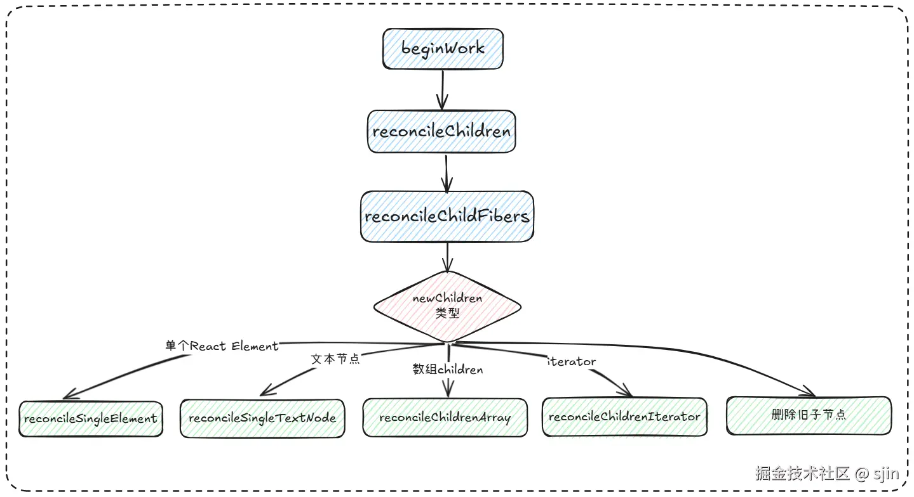
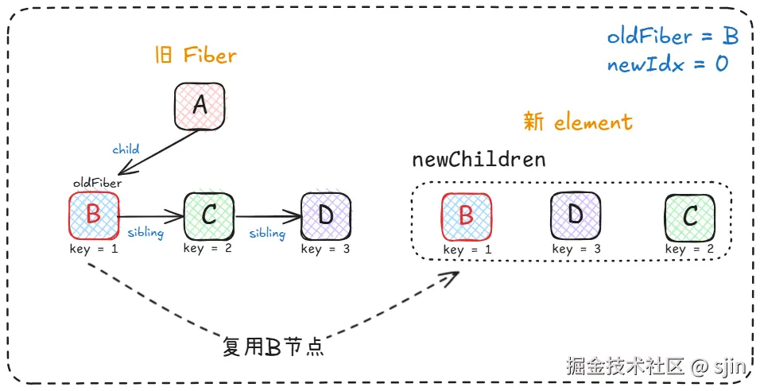
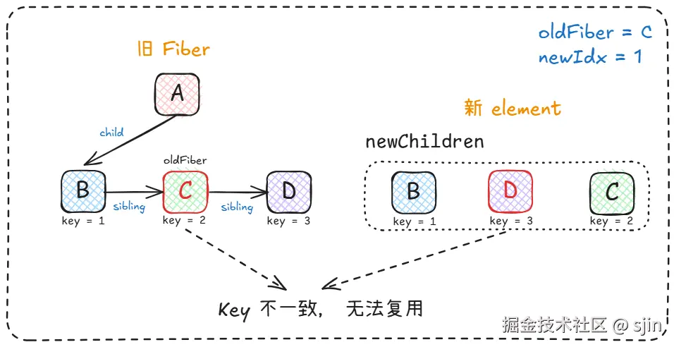
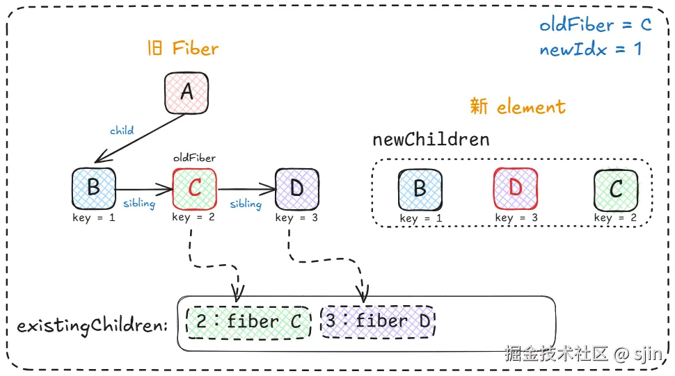
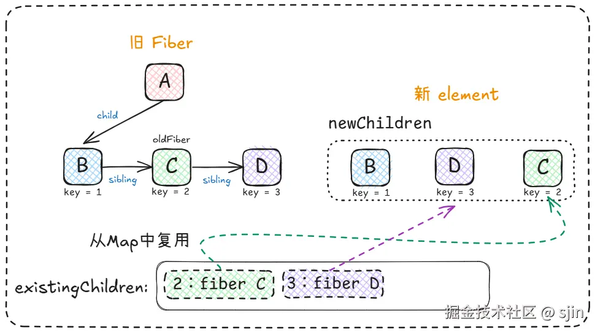

# React源码 - Diff 算法细节

## 简介

今天我想和大家聊聊React中一个非常核心的概念——Diff算法。这不仅是React高效渲染的关键，更是一种精妙的算法设计思想。

React 的 **Diff 算法**（也叫 Reconciliation 协调算法）是 React 将 **React Element 转换成 Fiber** 的更新过程中的核心步骤，用来决定哪些节点可以复用、哪些要新建、哪些要删除、哪些需要移动。

> 注意： diff 算法是**老的 fiber** 和 **新的 element** 进行比较。并生成新的fiber。

## 旧 Diff 面临的问题

React 在 Fiber 之前的 **旧 Diff 算法（Stack Reconciler, React 15 及以前）** 面临的效率问题促使了 Fiber 的设计。

旧算法尝试做最优 DOM 更新，使用 **最长公共子序列（LCS）** 思路比较新旧 children 列表。
LCS 的动态规划解法在最坏情况下复杂度是 **O(n²)** ，嵌套子树递归叠加后可达 **O(n³)** 。

👉 举例：\
`[A,B,C,D] → [D,C,B,A]`，旧算法会尝试各种重排组合，代价极高。

## 新 diff 算法特点

*   **不跨层级比较**: 通过只进行同级比较, Diff 算法在 O(n) 时间复杂度内完成，而不是 stack reconciler O(n³)。当新、旧节点的 type 不同，直接删除旧节点，创建新节点。从而达到更高效的目的。
*   **节点复用**：最大限度复用已有节点，只有必要时才新增/删除。
*   **列表 Diff 依赖 key**：借助 `key` 属性，用户可以指导 React 更精确地复用节点。

## Diff 算法的实现

对 React diff 算法有了基本的认识之后，下面就让我们看看 React 团队是如何实现新diff算法的。想了解实现细节，最直接的方法就是阅读源码。diff 算法其实是发生在 Render Phase 阶段。如想了解 Render Phase 的完整流程，可以看一下我之前发布的一篇文章： [React 源码 - Render Phase 的工作细节 - 掘金](https://juejin.cn/post/7504461472237846582)

diff 算法的具体调用栈如下图所示：



从上图可以看出 React 的 diff 算法 是发生在 Render Phase 的 `beginWork` 子阶段中。
通过调用 `reconcileChildren` 方法 和 `reconcileChildFiber`方法，根据 children 的不同类型来执行不同的 diff 操作。

下面为简化后的`reconcileChildFiber`源码, 如果想阅读完整源码，可以访问首行注释的地址。

```js title="packages/react-reconciler/src/ReactChildFiber.js"
function reconcileChildFibers(returnFiber, currentFirstChild, newChild, lanes) {
  // This function is not recursive.
  // If the top level item is an array, we treat it as a set of children,
  // not as a fragment. Nested arrays on the other hand will be treated as
  // fragment nodes. Recursion happens at the normal flow.
  // Handle top level unkeyed fragments as if they were arrays.
  // This leads to an ambiguity between <>{[...]}</> and <>...</>.
  // We treat the ambiguous cases above the same.
  var isUnkeyedTopLevelFragment = typeof newChild === 'object' && newChild !== null && newChild.type === REACT_FRAGMENT_TYPE && newChild.key === null;

  if (isUnkeyedTopLevelFragment) {
    newChild = newChild.props.children;
  } // Handle object types


  if (typeof newChild === 'object' && newChild !== null) {
    switch (newChild.$$typeof) {
      // 单子节点
      case REACT_ELEMENT_TYPE:
        return placeSingleChild(reconcileSingleElement(returnFiber, currentFirstChild, newChild, lanes));

      case REACT_PORTAL_TYPE:
        return placeSingleChild(reconcileSinglePortal(returnFiber, currentFirstChild, newChild, lanes));

      case REACT_LAZY_TYPE:
        var payload = newChild._payload;
        var init = newChild._init; // TODO: This function is supposed to be non-recursive.

        return reconcileChildFibers(returnFiber, currentFirstChild, init(payload), lanes);
    }

    // 多子节点
    if (isArray(newChild)) {
      return reconcileChildrenArray(returnFiber, currentFirstChild, newChild, lanes);
    }

    if (getIteratorFn(newChild)) {
      return reconcileChildrenIterator(returnFiber, currentFirstChild, newChild, lanes);
    }

    throwOnInvalidObjectType(returnFiber, newChild);
  }

  if (typeof newChild === 'string' && newChild !== '' || typeof newChild === 'number') {
    return placeSingleChild(reconcileSingleTextNode(returnFiber, currentFirstChild, '' + newChild, lanes));
  }

  {
    if (typeof newChild === 'function') {
      warnOnFunctionType(returnFiber);
    }
  } // Remaining cases are all treated as empty.


  return deleteRemainingChildren(returnFiber, currentFirstChild);
}
```

结合上面的图片，我相信大家都能读懂这段代码。这段代码的逻辑就是根据children的类型来调用不同的方法。在这篇文章中，我想着重介绍一下 `reconcileSingleElement` 和 `reconcileChildrenArray` 方法，分别对应的是 `children` 为单节点和为多节点的情况。这两个方法中运用到了 fiber 上的一个关键属性，那就是 `key`。我相信大家或多或少对该属性都有一些了解。我希望通过下面的讲解，能让大家对 `key` 有一个更细致的认识，并通过对源码的解读能够在自己的实际开发中更合理的使用 `key` 属性。

## `reconcileSingleElemt`

先来看下 `reconcileSingleElemt` 简化后的源码:

```js title="packages/react-reconciler/src/ReactChildFiber.js"
function reconcileSingleElement(returnFiber, currentFirstChild, element, lanes) {
  var key = element.key;
  var child = currentFirstChild;

  while (child !== null) {
    // TODO: If key === null and child.key === null, then this only applies to
    // the first item in the list.
    if (child.key === key) {
      var elementType = element.type;

      if (elementType === REACT_FRAGMENT_TYPE) {
        if (child.tag === Fragment) {
          deleteRemainingChildren(returnFiber, child.sibling);
          var existing = useFiber(child, element.props.children);
          existing.return = returnFiber;

          {
            existing._debugSource = element._source;
            existing._debugOwner = element._owner;
          }

          return existing;
        }
      } else {
        if (child.elementType === elementType || ( // Keep this check inline so it only runs on the false path:
         isCompatibleFamilyForHotReloading(child, element) ) || // Lazy types should reconcile their resolved type.
        // We need to do this after the Hot Reloading check above,
        // because hot reloading has different semantics than prod because
        // it doesn't resuspend. So we can't let the call below suspend.
        typeof elementType === 'object' && elementType !== null && elementType.$$typeof === REACT_LAZY_TYPE && resolveLazy(elementType) === child.type) {
          deleteRemainingChildren(returnFiber, child.sibling);

          var _existing = useFiber(child, element.props);

          _existing.ref = coerceRef(returnFiber, child, element);
          _existing.return = returnFiber;

          {
            _existing._debugSource = element._source;
            _existing._debugOwner = element._owner;
          }

          return _existing;
        }
      } // Didn't match.


      deleteRemainingChildren(returnFiber, child);
      break;
    } else {
      deleteChild(returnFiber, child);
    }

    child = child.sibling;
  }

  if (element.type === REACT_FRAGMENT_TYPE) {
    var created = createFiberFromFragment(element.props.children, returnFiber.mode, lanes, element.key);
    created.return = returnFiber;
    return created;
  } else {
    var _created4 = createFiberFromElement(element, returnFiber.mode, lanes);

    _created4.ref = coerceRef(returnFiber, currentFirstChild, element);
    _created4.return = returnFiber;
    return _created4;
  }
}
```

1.  **遍历旧 fiber 链表**

    *   key 不同 → 删除，继续找。
    *   key 相同 → 检查类型。

2.  **key + type 相同** → 调用 `useFiber` 复用旧 fiber。

3.  **key 相同但 type 不同** → 删除旧 fiber，之后新建。

4.  **没有找到匹配的 fiber** → 直接新建 fiber。

上面为 `reconcileSingleElemt` 的整体流程，针对的是 children 为单 element 的情况。

虽然新的element是单节点，但旧的 fiber 有可能有多个 child。 所以，首先会通过 `while` 循环遍历每一个旧的 child，尝试为新的 element 找到 `key` 和 `type` 都与之匹配的 fiber。

如果找到，则使用 `useFiber` 方法进行复用并调用`deleteRemainingChildren` 删除旧 fiber 中的剩余子节点。
如果 `while` 循环结束还没有找到，则会创建新的 fiber。

总的来说，`reconcileSingleElemt` 的源码还是比较好理解的。接下来将介绍 `reconcileChildrenArray` 的逻辑，相较于 `reconcileSingleElemt` 要复杂一些。

## `reconcileChildrenArray`

先来看下简化后的源码：

```js title="packages/react-reconciler/src/ReactChildFiber.js"
function reconcileChildrenArray(returnFiber, currentFirstChild, newChildren, lanes) {
  let resultingFirstChild = null;
  let previousNewFiber = null;
  let oldFiber = currentFirstChild;
  let lastPlacedIndex = 0;
  let newIdx = 0;
  let nextOldFiber = null;

  // ========== 1. 顺序对比阶段 ==========
  for (; oldFiber !== null && newIdx < newChildren.length; newIdx++) {
    if (oldFiber.index > newIdx) {
      nextOldFiber = oldFiber;
      oldFiber = null;
    } else {
      nextOldFiber = oldFiber.sibling;
    }

    const newFiber = updateSlot(returnFiber, oldFiber, newChildren[newIdx], lanes);

    if (newFiber === null) {
      if (oldFiber === null) oldFiber = nextOldFiber;
      break;
    }

    lastPlacedIndex = placeChild(newFiber, lastPlacedIndex, newIdx);

    if (previousNewFiber === null) {
      resultingFirstChild = newFiber;
    } else {
      previousNewFiber.sibling = newFiber;
    }

    previousNewFiber = newFiber;
    oldFiber = nextOldFiber;
  }

  // ========== 2. 处理边界情况 ==========
  if (newIdx === newChildren.length) {
    // 新 children 用完 → 删除剩余旧 fiber
    deleteRemainingChildren(returnFiber, oldFiber);
    return resultingFirstChild;
  }

  if (oldFiber === null) {
    // 旧 fiber 用完 → 创建剩余新 fiber
    for (; newIdx < newChildren.length; newIdx++) {
      const newFiber = createChild(returnFiber, newChildren[newIdx], lanes);
      if (newFiber === null) continue;

      lastPlacedIndex = placeChild(newFiber, lastPlacedIndex, newIdx);
      if (previousNewFiber === null) {
        resultingFirstChild = newFiber;
      } else {
        previousNewFiber.sibling = newFiber;
      }
      previousNewFiber = newFiber;
    }
    return resultingFirstChild;
  }

  // ========== 3. Map diff 阶段 ==========
  const existingChildren = mapRemainingChildren(returnFiber, oldFiber);

  for (; newIdx < newChildren.length; newIdx++) {
    const newFiber = updateFromMap(existingChildren, returnFiber, newIdx, newChildren[newIdx], lanes);
    if (newFiber !== null) {
      lastPlacedIndex = placeChild(newFiber, lastPlacedIndex, newIdx);
      if (previousNewFiber === null) {
        resultingFirstChild = newFiber;
      } else {
        previousNewFiber.sibling = newFiber;
      }
      previousNewFiber = newFiber;
    }
  }

  existingChildren.forEach(child => deleteChild(returnFiber, child));
  return resultingFirstChild;
}
```

不难发现， `reconcileChildrenArray` 方法中有三个 `for` loop， 我们可以将它们看作三个阶段， 分别为：

1.  **顺序对比阶段**
    *   从头开始，新旧数组逐一比较。
    *   相同 key/type → 复用；遇到不匹配 → break。
2.  **理边界阶段**
    *   新数组比旧数组短 → 删除多余旧节点。
    *   新数组比旧数组长 → 创建多余新节点。
3.  **Map Diff 阶段**
    *   把剩余的旧节点放进 Map（key → fiber）。
    *   新节点依次查找 Map：找到就复用，没找到就新建。
    *   未被复用的旧节点 → 删除。
    *   顺序不一致的复用节点 → 打上 Placement（移动）标记。

### 阶段1 - 顺序对比阶段

首先， React 会默认新的 Children Array 和旧的 Children Array 是完全一致的。所以，会先同时遍历newChildren 和 oldFiber 来进行顺序对比，并尝试调用 `updateSlot` 复用旧的 fiber。

`updateSlot` 方法会判断新旧节点的 `key` 和 `type` 是否相等，如果相等，则返回并复用旧的fiber； 如果不相等，则表示无法复用旧的fiber，所以，返回 null 并退出第一阶段的 for 循环，结束本次遍历。

**总结**：
这个阶段最优：如果 key 和 type 都一样，直接调用 `useFiber` 复用旧 fiber。一旦遇到不能复用（key/type 不匹配） 则退出顺序对比，进入阶段 3。

### 阶段2 - 处理边界阶段

阶段2处理的是边界情况。

当阶段一遍历结束后，如果 `oldFiber` 有值， 但 `newChildren` 已遍历完毕， 说明有移除的旧节点，此时便会调用`deleteRemainingChildren` 删除剩余旧 fiber。

当阶段一遍历结束后，如果 `oldFiber` 为空，但 `newChildren` 还没有遍历完，说明有新增节点，于是调用 `createChild` 创建剩余新节点。

**总结**：
这是 **fast path**，只做纯删除或纯新增，性能最好。

### 阶段3 - Map Diff阶段

如果阶段1没有遍历结束便提前终止，说明在顺序同时遍历新旧children的时候，新旧两个节点无法复用。有三种原因可能导致这种情况，分别是：

1.  中间插入元素
2.  中间删除元素
3.  元素位置变化

此时，会创建一个 `existingChildren` Map， 并将，旧fiber中剩余的节点存入map中，确保 可以快速判断 newChildren 中剩余的元素是否可以复用。

最后把没有被复用的旧 fiber 全部删除。

## `reconcileChildrenArray`示例：

为了方便同学们理解，下面将通过一个例子来演示整个过程：

比如，现在有一个 A 节点，在**旧 fiber** 中 A 节点的子元素为 **B->C->D**；在**新的 element** A 中， 它的子节点（代码中的`newChildren`）变为了 **B->D->C**。

**第一步：** **复用B节点**

首先，会进入第一阶段-顺序对比阶段。该阶段会同时遍历 `oldFiber` 和 `newChildren`。此时 `oldFiber` 为 B， `newIdx`等于0。 因为type和key都一样，所以直接复用。



**第二步：** **key不一致，提前中断第一阶段**

B节点成功复用后， 第一阶段会继续循环。这时，**oldFiber** 会变成 **B.sibling**, 也就是 C 节点， `newIdx` 也变成了 1， 对应D节点。

但是由于 `key` 不一致，无法复用， `updateSlot` 最终返回 `null`。 导致第一阶段循环**提前中断**，并进入第三阶段- Map Diff阶段。



**第三步: 创建Map**

第一阶段的 `for` 循环提前中断后，来到第三阶段。此时，会先创建一个 `existingChildren` map，并把剩余旧 fiber，C 和 D 存入 map， Map 的 key 为 fiber 的 key，value 则为 fiber对象本身。



**第四步：** **遍历剩余 newChildren，用 key 查 Map**



最后，遍历剩余 `newChildren`，并调用 `updateFromMap` 用 `key` 查 Map：
如果命中则返回该fiber并复用。
未命中则新建fiber并返回新建的fiber。
在该示例中，`newChildren` 中的 **D** 和 **C** 通过 key 2 和 key 3 分别命中，所以会直接复用旧 fiber 中的 **C** 和 **D**。

至此，整个diff流程就完成了。

## 小结：

我希望这篇文章能帮助大家更好的理解 React 的 diff 算法，并能回答出下面几个问题：

1.  **React 为什么需要 Diff 算法？**

2.  **React Diff 的三大基本策略是什么？**

3.  **key 的作用是什么？为什么推荐使用稳定的 key？**
