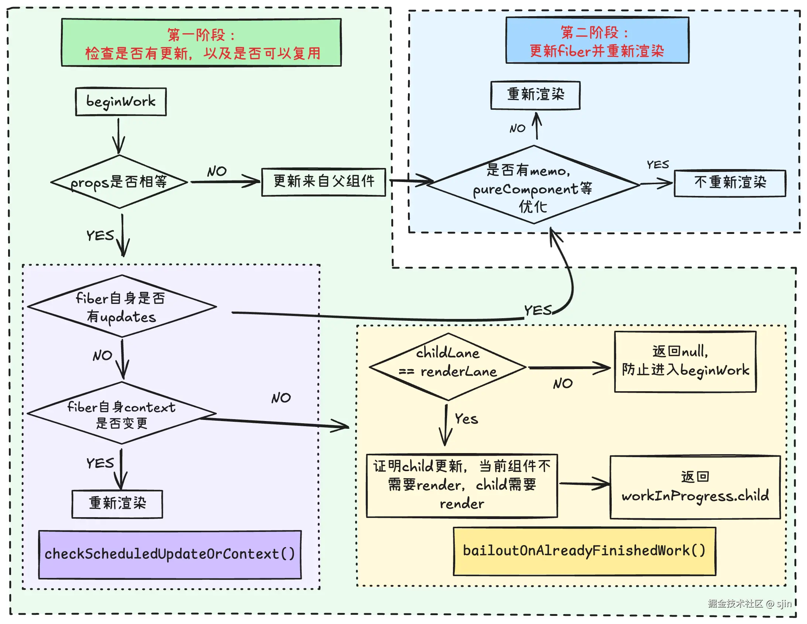
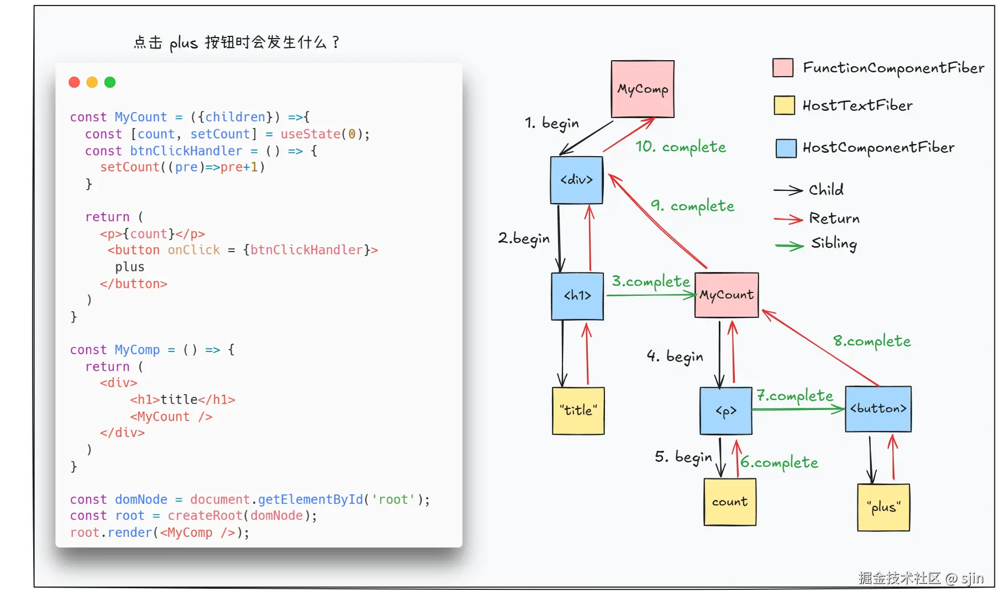

# Render Phase

众所周知， React 从开始创建到页面呈现的过程中，经历了两个阶段，分别是 **Render Phase** 和 **Commit Phase**。

本篇将重点关注于 Render Phase 的源码及具体细节。但在此之前，我们先来简单了解一下这两个阶段分别做了些什么。

*   **Render Phase**：这个过程会执行类组件的渲染函数，或者执行函数组件本身。 目的是得到新的 React Element，并通过 diff 算法比较出哪里需要更新，会处理每一个待更新的 fiber 节点，并给他们打上 flag 标志。
*   **Commit Phase**：执行完 Reader Phase 之后，待更新的 fiber 会存在不同的 flag 标志，Commit 阶段的目的就是，根据 flag 处理这些 fiber，包括操作真实DOM、执行生命周期等。

> 对于 React 初学者可能不了解 flag 是什么。
> flag 其实就是v17+ 版本中 fiber 节点的一个基本属性，类似于 v16 版本中的 effectTag。它的作用是用来收集 effectList。

有了简单理解后，我们就可以更好的理解源码的实现原理及细节。

要想阅读源码，我们还需要知道，Render Phase 对应的函数是什么以及它的调用栈。
Render Phase 对应的函数为 `renderRootSync` 和 `renderRootConcurrent`。他们分别代表 **Legacy** 模式 和 **Concurrent** 模式下的 Render Phase。

那么，这两个方法是如何被调用的呢？ 有了解过 React 运行时的同学应该知道，无论是初始化还是更新 state，React最后都会调用 `scheduleUpdateOnFiber` 函数。
而在 `scheduleUpdateOnFiber` 函数中，通过调用 `performSyncWorkOnRoot` 方法 或 `performConcurrentWorkOnRoot` 方法进入调和阶段，也就是更新 fiber 树的状态，渲染DOM 以及更新视图。

下面，我们统称 `performSyncWorkOnRoot` 和 `performConcurrentWorkOnRoot` 为 `performWorkOnRoot`。

`performWorkOnRoot` 就是我们想找的函数，这个函数被定义在 *facebook/react/packages/react-reconciler/src/ReactFiberWorkLoop.js* 文件中。通过源码，你会发现这个方法的代码很长。但其实我们只需要知道是这个方法调用了 `renderRoot`函数 和 `finishConcurrentRender`函数。 而`finishConcurrentRender` 正是 commit phase 被调用的地方。

下面，让我们正是进入源码分析：

## renderRoot

我们先来看一下 `renderRootSync` 函数究竟做了什么。

```js title="packages/react-reconciler/src/ReactFiberWorkLoop.js"

function renderRootSync(root, lanes){
    workLoopSync();
    workInProgressRoot = null;
    workInProgressRootRenderLanes = NoLanes;
}
```

`renderRootSync` 的核心流程十分简单， 就是执行 `workLoopSync`。在 **concurrent mode** 下，则会执行 `workLoopConcurrent`。下面我们将统一称他们为 `workLoop`。

## workLoop

***workLoop*** 是一个工作循环。
在 **Legacy** 模式下的 `workLoop` 没有优先级之分。
在 **Concurrent** 模式下，`workLoop` 遇到更高优先级的任务，会先暂停当前的任务，去执行更高优先级的任务。
在初始化的过程中， fiber树通过 `workLoop` 过程去构建。 在一次更新中，并不是所有Fiber都会进入 `workLoop` 中，而是每一个待更新或者是Child需要更新的fiber， 会进入`workLoop`。

下面，我们来看一下 `workLoop` 的具体实现：

```js title="packages/react-reconciler/src/ReactFiberWorkLoop.js"

// Legacy 模式
function workLoopSync(){
    while (workInProgress !== null){
        performUnitOfWork(workInProgress)
    }
}

// Concurrent 模式
function workLoopConcurrent(){
    /* 通过主动让出主线程（yielding）来平衡 React 渲染任务与其他浏览器任务（如动画）的资源分配。*/
    if (workInProgress !== null) {
        const yieldAfter = now() + (nonIdle ? 25 : 5);
        do {
          performUnitOfWork(workInProgress);
        } while (workInProgress !== null && now() < yieldAfter);
    }
}
```

如上面代码所示，

*   **Legacy** 模式下，只要 `workInProgress` 不为空（还有需要调和的fiber），就会循环调用 `performUnitOfWork`。
*   **Concurrent** 模式下， 还会额外判断是否有更高优先级的任务，如果有会中断当前任务。

> workLoop 的执行单元就是 fiber 节点， 而且更新每一个fiber的函数叫做 performUnitOfWork。

## performUnitOfWork

`workLoop` 会循环调用 `performUnitOfWork` 来处理并更新每一个fiber节点

```js title="packages/react-reconciler/src/ReactFiberWorkLoop.js"
function performUnitOfWork(unitOfWork){
    // 递--向下调和
    let next = beginWork(current, unitOfWork, subtreeRenderLanes);
    unitOfWork.memoizedProps = unitOfWork.pendingProps;

    // 归--向上归并
    if(next === null){
        competeUnitOfWork(unitOfWork);
    }else{
        workInProgress = next;
    }
}
```

在 `performUnitOfWork` 内，调用了两个关键函数。 分别是 `beginWork` 和 `completeUnitOfWork`:

*   `beginWork`:**向下调和**。 由 `fiberRoot` 按照 Child 指针逐层向下调和， 期间会执行函数组件、实例类组件、diff算法调和子节点，打不同的标签。
*   `completeUnitOfWork`: **向上归并**。如果有 `sibling` 会返回兄弟节点，如果没有会返回 `return` 父级， 一直返回到 `fiberRoot`。对于初始化流程会创建 DOM，对 DOM 元素进行事件收集， 处理 style、className 等。
    这样就完成了整个 fiber 树的 workLoop 流程。

所以，这个过程类似与**深度优先遍历**。

## beginWork

beginWork 方法会处理当前fiber节点并返回下一个节点。

如果有下一个需要调和的节点，则返回该节点，如果没有，则返回null

```js title="packages/react-reconciler/src/ReactFiberBeginWork.js"

function beginWork(current, workInProgress, renderLanes) {
  // 第一阶段：判断是否需要更新组件
  let didReceivedUpdate = false;
  /*  --------------第一部分---------------  */
  if (current !== null) {
    // 更新阶段：对比新旧 props 或上下文变化
    const oldProps = current.memoizedProps;
    const newProps = workInProgress.pendingProps;

    // 判断 props 或 legacy context 是否变化
    if (oldProps !== newProps || hasLegacyContextChanged()) {
      didReceivedUpdate = true;
    } else {
      // 通过额外逻辑判断是否需要更新（简化示例）
      const hasScheduledUpdataOrContext = checkScheduledUpdateOrContext(current, renderLanes);
      if (!hasScheduledUpdataOrContext){
      	didReceivedUpdate = false;
         return attemptEarlyBailoutIfNoScheduleUpdate(current,workInProgress,renderLanes)
      }
	  didReceivedUpdate = false;
    }
  } else {
    // 初始化阶段无需更新
    didReceivedUpdate = false;
  }

  /*  --------------第二部分---------------  */
  // 根据组件类型调用不同更新逻辑
  switch (workInProgress.tag) {
    case FunctionComponent: {
      const Component = workInProgress.type;
      return updateFunctionComponent(
        current,
        workInProgress,
        Component,
        newProps,
        renderLanes
      );
    }
    case ClassComponent: {
      const Component = workInProgress.type;
      return updateClassComponent(
        current,
        workInProgress,
        Component,
        renderLanes
      );
    }
    case HostComponent: {
      return updateHostComponent(current, workInProgress, renderLanes);
    }
    default: {
      throw new Error(`Unknown component type: ${workInProgress.tag}`);
    }
  }
}

// 辅助函数示例（React 内部实现简化）
function updateFunctionComponent(current, workInProgress, Component, props, renderLanes) {
  const nextChildren = Component(props);
  reconcileChildren(current, workInProgress, nextChildren, renderLanes);
  return workInProgress.child;
}

function checkScheduledUpdate(workInProgress) {
  // 检查是否有待处理的更新（如 useState/useReducer 触发的更新）
  return workInProgress.lanes !== NoLanes;
}
```

beginWork 可以分为两个阶段，阶段1 是用来判断 workInProgress 是否需要更新，以及能否复用。如果需要更新，则进入第二阶段，第二阶段。第二阶段的作用是，根据 workInProgress.tag 来执行不同类型的fiber 处理。

从上面代码，我们可以总结出大体流程：

**1. 判断更新/初始化**：

*   首先通过 `current !== null` 来判断是 mount 还是 update。而第一阶段主要是判断组件是否需要更新以及是否可以复用，所以如果是 mount 阶段，会直接跳过第一阶段，进入第二阶段。

**2. 第一阶段：**

*   判断 props 和 legacy context 是否变化， 如果变化则标记 didReceivedUpdate = true， 否则标记 didReceivedUpdate = false
*   如果 props 和 legacy context没有变化， 通过调用 `checkScheduledUpdateOrContext` 方法来判断当前 fiber 是否有待处理的更新和context， 如果有更新则标记 `didReceivedUpdate = true`， 否则标记 didReceivedUpdate = false。并将返回值赋值给`hasScheduledUpdataOrContext`
*   如果 `hasScheduledUpdataOrContext === false`， 证明当前组件没有更新， 则调用`bailoutOnAlreadyFinishedWork` 来复用之前的fiber， 返回 null 或 workInProgress.child； 并结束当前 `beginWork`, 回到 `workLoop` 函数继续执行
*   `hasScheduledUpdataOrContext === true`， 证明当前组件有 updates 或 context 变化， 则进入第二阶段

#### checkScheduledUpdateOrContext

```js title="packages/react-reconciler/src/ReactFiberBeginWork.js"

function checkScheduledUpdateOrContext(
  current: Fiber,
  renderLanes: Lanes,
): boolean {
  // Before performing an early bailout, we must check if there are pending
  // updates or context.
  const updateLanes = current.lanes;
  if (includesSomeLane(updateLanes, renderLanes)) {
    return true;
  }
  // No pending update, but because context is propagated lazily, we need
  // to check for a context change before we bail out.
  const dependencies = current.dependencies;
  if (dependencies !== null && checkIfContextChanged(dependencies)) {
    return true;
  }
  return false;
}
```

#### bailoutOnAlreadyFinishedWork

attemptEarlyBailoutIfNoScheduledUpdate 是 React 渲染优化中的关键逻辑，用于在特定条件下 提前终止 Fiber 节点的处理，避免不必要的计算。以下是对其核心逻辑的逐步分析：

```js title="packages/react-reconciler/src/ReactFiberBeginWork.js"

function bailoutOnAlreadyFinishedWork(
  current: Fiber | null,
  workInProgress: Fiber,
  renderLanes: Lanes,
): Fiber | null {
  // 1. 检查子树是否需要副作用收集
  if (!includesSomeLane(renderLanes, workInProgress.childLanes)) {
    // 如果子树完全不需要处理，直接返回 null（完全跳过）
    return null;
  }

  // 2. 克隆子 Fiber 节点（复用现有树结构）
  cloneChildFibers(current, workInProgress);

  // 3. 返回第一个子节点，继续处理（可能子节点有更高优先级的更新）
  return workInProgress.child;
}
```

该方法首先会调用`includesSomeLane`函数来判断当前渲染优先级（`renderLanes`）是否包含子树的更新优先级（`childLanes`）。</br>
如果子树无更新直接返回 `null`，完全跳过该节点的所有子节点处理。然后，直接进入 `completeUnitOfWork` 阶段。</br>
这也是 React reconciliation 流程所做的优化，所以，并不是整个 fiber tree 都会被调和。

**3. 第二阶段：**
如果组件不能复用，则会进入该阶段

*   更新fiber， 根据组件的类型，调用对应的方法，然后进行重新渲染。并返回workInProgress.child

下面就以函数组件为例：

```js title="packages/react-reconciler/src/ReactFiberBeginWork.js"
 // 核心更新逻辑（以函数组件为例）
function updateFunctionComponent() {
  const nextChildren = renderWithHooks(current,workInProgress,Component,extProps,context);
  reconcileChildren(current, workInProgress, nextChildren);
  return workInProgress.child;
}

  // 调和子节点（Diff 算法入口）
export function reconcileChildren(
  current: Fiber | null,
  workInProgress: Fiber,
  nextChildren: any,
  renderLanes: Lanes,
) {
  if (current === null) {
    // If this is a fresh new component that hasn't been rendered yet, we
    // won't update its child set by applying minimal side-effects. Instead,
    // we will add them all to the child before it gets rendered. That means
    // we can optimize this reconciliation pass by not tracking side-effects.
    workInProgress.child = mountChildFibers(
      workInProgress,
      null,
      nextChildren,
      renderLanes,
    );
  } else {
    // If the current child is the same as the work in progress, it means that
    // we haven't yet started any work on these children. Therefore, we use
    // the clone algorithm to create a copy of all the current children.

    // If we had any progressed work already, that is invalid at this point so
    // let's throw it out.
    workInProgress.child = reconcileChildFibers(
      workInProgress,
      current.child,
      nextChildren,
      renderLanes,
    );
  }
}
```

`reconcileChildren` 函数的作用是为 `workInProgress` fiber 生成 child fiber，并返回。使 performUnitOfWork 可以处理下一个 fiber。

### reconcileChildFiber

`reconcileChildFibers` 的核心作用可以概括为：

1.  **Diff 算法实现**：高效对比新旧子节点。
2.  **Fiber 树构建**：生成或复用 Fiber 节点，构建链表结构的 Fiber 树。
3.  **副作用标记**：为后续 DOM 操作提供依据。
4.  **虚拟DOM转换Fiber**：通过 `reconcileSingleElement` 函数将虚拟 `DOM` 转换成 `Fiber`

`reconcileChildFibers` 是 React 协调算法（Reconciliation）的核心函数之一，位于 React Fiber 架构的实现中。它的作用是在组件更新过程中，**对比新旧子节点（Children）的差异，生成新的子 Fiber 节点树**，并标记需要进行的 DOM 操作（如插入、更新、删除等）。 方便 Commit Phase 对 DOM 执行相应的操作。

`performUnitOfWork` 接收到beginWork返回的下一个需要更新的fiber `next` 后，会判断 `next` 是否为null。
如果不为null，回到 `workLoop` 函数继续执行 `performUnitOfWork`，直到 `next` 为null，即完成更新。
如果为 null，结束向下调和，进入 `completeUnitOfWork` 函数，执行向上归并的逻辑。

至此，`beginWork` 函数完成了组件的更新工作。所以 `beginWork` 函数的作用是更新组件，并返回下一个要更新的fiber。

下面通过一张 Flow Chart 来更直观的总结一下 `beginWork` 的流程：



## competeUnitOfWork

在执行完 `beginWork` 的更新流程后，接下来会执行 `competeUnitOfWork`：

```js title="packages/react-reconciler/src/ReactFiberWorkLoop.js"
function completeUnitOfWork(unitOfWork: Fiber): void {
  // Attempt to complete the current unit of work, then move to the next
  // sibling. If there `are` no more siblings, return to the parent fiber.
  let completedWork: Fiber = unitOfWork;
  do {
    if ((completedWork.flags & Incomplete) !== NoFlags) {
      // This fiber did not complete, because one of its children did not
      // complete. Switch to unwinding the stack instead of completing it.
      //
      // The reason "unwind" and "complete" is interleaved is because when
      // something suspends, we continue rendering the siblings even though
      // they will be replaced by a fallback.
      const skipSiblings = workInProgressRootDidSkipSuspendedSiblings;
      unwindUnitOfWork(completedWork, skipSiblings);
      return;
    }

    // The current, flushed, state of this fiber is the alternate. Ideally
    // nothing should rely on this, but relying on it here means that we don't
    // need an additional field on the work in progress.
    const current = completedWork.alternate;
    const returnFiber = completedWork.return;

    // create dom, process prop and state update, trigger effects
    // return the new  spawned new work, such as side effect
    let next = completeWork(current, completedWork, entangledRenderLanes);

    if (next !== null) {
      // Completing this fiber spawned new work. Work on that next.
      workInProgress = next;
      return;
    }

    const siblingFiber = completedWork.sibling;
    if (siblingFiber !== null) {
      // If there is more work to do in this returnFiber, do that next.
      workInProgress = siblingFiber;
      return;
    }
    // Otherwise, return to the parent
    // $FlowFixMe[incompatible-type] we bail out when we get a null
    completedWork = returnFiber;
    // Update the next thing we're working on in case something throws.
    workInProgress = completedWork;
  } while (completedWork !== null);

  // We've reached the root.
  if (workInProgressRootExitStatus === RootInProgress) {
    workInProgressRootExitStatus = RootCompleted;
  }
}
```

**completeUnitOfWork** 流程如下：

`completeUnitOfWork` 函数的主要操作在 do while 循环中执行，直到 `completedWork` 被更新为null。

*   首先，会调用 `completeWork` 方法，该方法用来处理 props 和 state 的更新，并触发 effects。最后返回在该过程中引发的其他 work，例如副作用等。并将返回值赋给 `next`。
*   如果 `next` 不为空，说明有新的 work 产生，所以需要将 `workInProgress` 指向 `next` 用来优先处理该 work。并直接退出循环。
*   如果 `completedWork` 有 sibling，则 优先处理 它的 sibling fiber，所以将 `workInProgress` 指向 siblingFiber。并退出循环。
*   如果，上面两种情况都没有发生，则会将 `completedWork` 变更为 `completeWork.return`, 也就是它的父节点， 用于继续执行循环并处理它的父节点，并将 `workInProgress` 指向新的 `completedWork` 节点。

## CompleteWork

`completeWork` 是 React Fiber 架构中  **“归阶段”（Complete Phase）**  的核心函数，负责处理 Fiber 节点的属性（props）、创建或更新 DOM 节点，并收集副作用（Effect）。它是 React 渲染流程中 从 Fiber 树到 DOM 树的桥梁。

之前提到，`beginWork` 会通过 `diff` 等手段，给 `fiber` 打上不同的 flag 标志。然后在 commit 阶段， 对这些 flags 进行统一处理。 那么 Commit 阶段是如何快速高效的找到 flag 呢。 那就是通过 fiber 上的 `subtreeFlags` 属性。 原理类似于通过 `childLane` 定位触发更新的 fiber。

所以 `completeWork` 的另一个关键任务就是根据 `flag` 属性建立 `subtreeFlags` 属性。

阅读 `completeWork` 源码会发现，它通过 switch case 对不同类型 tag 的 fiber 进行了不同的处理。所以，completeWork 的源码很长，有1000多行。但不论哪一种case，都会执行 bubbleProperties 函数。 这里就以 ClassComponent 和 HostComponent 为例：

```js title="packages/react-reconciler/src/ReactFiberCompleteWork.js"

function completeWork(
  current: Fiber | null,  // 旧的 Fiber 节点（更新时存在）
  workInProgress: Fiber,  // 当前正在处理的 Fiber 节点
  renderLanes: Lanes,     // 渲染优先级
): Fiber | null {
  const newProps = workInProgress.pendingProps;
  switch (workInProgress.tag) {

    case ClassComponent: { // 处理 Context、Ref 等逻辑
        bubbleProperties(workInProgress)
        return null;
    }
    // 处理普通 DOM 元素（如 div、span）
    case HostComponent: {
      const type = workInProgress.type;
      if (current !== null && workInProgress.stateNode != null) {
        // 更新阶段：对比新旧属性，标记更新
        updateHostComponent(current, workInProgress, type, newProps);
      } else {
        // 首次渲染：创建 DOM 节点，初始化属性
        const instance = createInstance(type, newProps, workInProgress);
        appendAllChildren(instance, workInProgress);
        finalizeInitialChildren(instance, type, newProps);
        workInProgress.stateNode = instance; // 关联 DOM 节点到 Fiber
      }
      bubbleProperties(workInProgress)
      return null;
    }
    // 处理文本节点
    case HostText: {}
    // 处理函数组件、类组件等（无 DOM 操作）
    case FunctionComponent:
    case ClassComponent: {
      // 处理 Context、Ref 等逻辑
      return null;
    }
    // ... 其他类型处理（如 Fragment、Portal 等）
  }
}
```

`bubbleProperties` 的目的就是根据子代 fiber 的 flag 属性，更新 subtreeFlags 属性。

`completeWork` 的核心职责是：

*   **DOM 节点的创建与更新**：根据 Fiber 节点的类型和状态，生成或更新对应的 DOM 节点。
*   **属性处理**：对比新旧属性差异，避免不必要的 DOM 操作。
*   **副作用标记**：构建副作用链表，为 `commit` 阶段提供更新依据。
*   **生产subtreeFlags**

> `completeWork` 会调用 `hostConfig.createInstance`（通常就是 `document.createElement`）来**实例化一个 DOM 节点对象**，或者调用 `prepareUpdate` 来计算属性差异并生成一个更新 payload。
>
> 但这一步**并不把这个新节点插到页面上**，也不真正去调用 `appendChild` / `setAttribute` / `removeChild`——它只是“造壳子”、算出要改什么。
>
> 真正修改浏览器 DOM 树都在 Commit 阶段

## 案例分析



## 总结

React 的 **Render Phase** 包含两个关键函数， 分别为 `beginWork` 和 `completeWork`:

#### **1. `beginWork`：向下递阶段**

`beginWork` 是 React 对 Fiber 节点进行处理的起点，负责：

1.  **根据 Fiber 节点类型（如函数组件、类组件、HostComponent 等）调用对应的渲染逻辑**。

    *   例如：调用函数组件（`renderWithHooks`）或类组件的 `render` 方法，生成子 ReactElement。

2.  **调和（Reconciliation）子节点**：

    *   对比新旧子节点（ReactElement 与旧 Fiber 树），生成新的子 Fiber 树（Diffing 算法）。

3.  **标记副作用（EffectTag）** ：

    *   如节点需要插入、更新或删除，会标记 `Placement`、`Update`、`Deletion` 等副作用。

4.  **性能优化（Bailout）** ：

5.  *   通过 `checkScheduledUpdateOrContext` 等逻辑判断是否可跳过该节点渲染（复用旧 Fiber）。

#### **2. `completeWork`：向上归阶段**

**作用**

当 `beginWork` 到达叶子节点后，开始通过 `completeWork` **自底向上** 完成 Fiber 节点的处理：

1.  **创建 DOM 节点（仅 HostComponent）** ：

    *   对原生 DOM 节点（如 `div`），首次渲染时会调用 `document.createElement` 创建真实 DOM。

2.  **处理 Props 和事件**：

    *   将 React 的 Props（如 `className`、`onClick`）映射到真实 DOM 属性。
    *   绑定合成事件（如 `onClick` 转换为原生事件监听）。

3.  **子树副作用冒泡**：

    *   将子节点的副作用（EffectTag）合并到父节点的 `effectList` 中，形成一条单向链表供 `commit` 阶段使用。

4.  **性能优化**：

    *   某些场景下可跳过 DOM 属性的更新（如 Props 未变化）。确保整棵 Fiber 树的每个节点都被 `completeWork` 处理到

理解了这两者的配合，你就把握住了 React Fiber 渲染阶段的核心：**先“向下”调和，再“向上”归并，不碰 DOM，只收集副作用**。

参考书籍：《深入浅出React开发指南》- 赵林林
